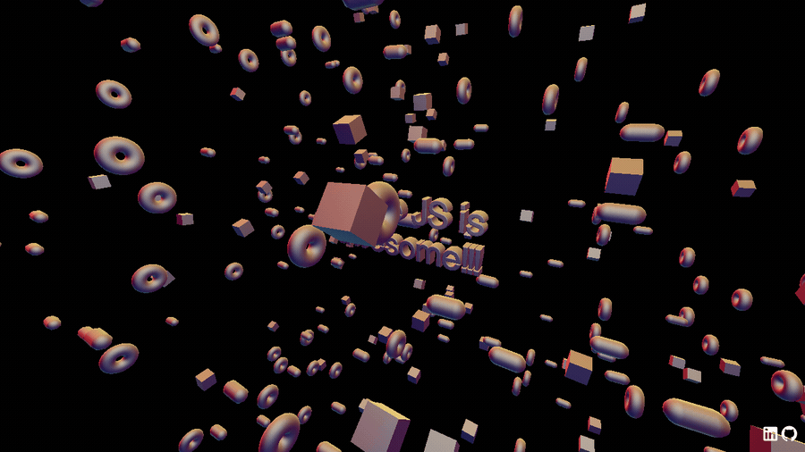

<h1 align="center">🔤 3D Text Playground</h1>

<p align="center">Beveled 3D typography floating in a field of matcap-shaded donuts, boxes, and cones — my first real dive into geometries, materials, and textures in Three.js.</p>

<p align="center">
  <a href="https://3d-text-threejs-etb811ac.netlify.app/"></a>
</p>

<p align="center">
  
</p>

<p align="center">
  
  
  
  
</p>

## About

Diving into the world of 3D graphics with Three.js! This project loads a typeface font, extrudes it into beveled `TextGeometry`, and centers it in the scene. Hundreds of randomly placed, rotated, and scaled meshes share a single **matcap material** for a slick lit look at almost no performance cost.

- ✍️ Font loading + beveled 3D text geometry
- 🍩 Hundreds of randomized meshes sharing one material
- 🎨 Matcap textures for cheap, great-looking shading
- 🖱️ Orbit controls to fly around the scene

## Tech

Three.js · WebGL · `TextGeometry` · matcap materials · GSAP · Vite

## Run locally

```bash
npm install   # first time only
npm run dev   # local server at localhost:8080
npm run build # production build in dist/
```

---

<p align="center"><i>Part of my Three.js journey · <a href="https://estebanacuna.dev">estebanacuna.dev</a></i></p>
